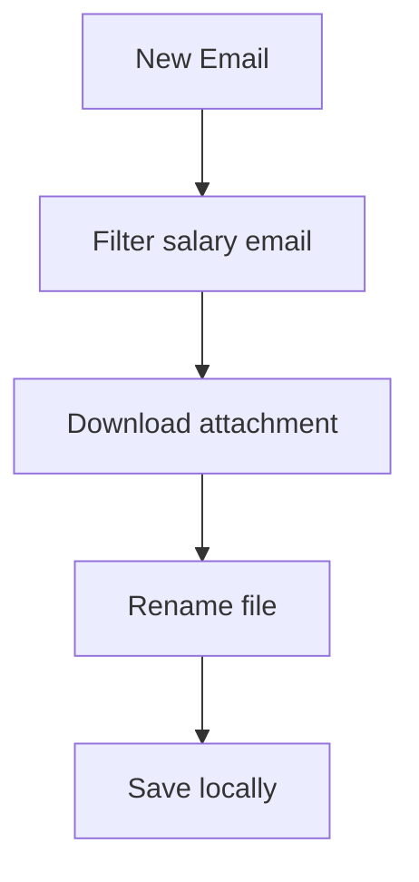
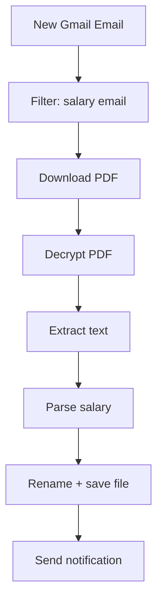

# Automated Salary PDF Processing System

## Overview

This document summarizes the design of a system that automatically:

- Detects salary-related emails
- Downloads attached PDF payslips
- Renames and stores them locally
- Optionally extracts and summarizes salary data
- Sends notifications (e.g., SMS)

---

## Core Automation (MVP)

### Components

- Gmail API
- Script (Node.js + TypeScript or Python)
- Cron job / Task Scheduler

### Functionality

1.  Monitor inbox

2.  Detect emails containing:
    - "plača za mesec X"

3.  Download PDF attachment

4.  Rename file:

        name_surname_placilna_lista_MM_YYYY.pdf

5.  Save to predefined folder

---

## Architecture



---

## Extended Features

### 1. Password-Protected PDFs

- Use libraries:
  - Python: pikepdf, PyPDF2
  - Node: pdf-lib (limited)

Example (Python):

```python
import pikepdf
with pikepdf.open("input.pdf", password="YOUR_PASSWORD") as pdf:
    pdf.save("decrypted.pdf")
```

---

### 2. Text Extraction

- Python: pdfplumber
- Node: pdf-parse

---

### 3. Salary Parsing

Use regex:

```python
import re
match = re.search(r"Neto\s+plača:\s+([\d,.]+)", text)
salary = match.group(1)
```

---

### 4. AI Integration (Optional)

Use LLMs for: - Flexible parsing - Summarization - Handling inconsistent
formats

---

### 5. Notifications

#### SMS (Twilio)

```ts
await client.messages.create({
  body: `Salary received: €${salary}`,
  from: '+123456',
  to: '+386...',
});
```

#### Alternatives

- Telegram bot
- Email notification
- Push notifications

---

## Full Pipeline



---

## Complexity Breakdown

Feature Difficulty

---

Download + rename Easy
Extract salary Medium
Handle passwords Medium
AI summarization Medium
SMS notification Easy

---

## Recommendations

1.  Start simple:
    - Gmail API + download + rename
2.  Add parsing later
3.  Add notifications
4.  Introduce AI only if needed

---

## Notes

- Use sender filtering for reliability
- Store passwords securely (e.g., environment variables)
- Be prepared for format changes in PDFs

---

## Conclusion

The system is fully feasible and can eliminate manual handling of salary
documents while adding useful automation and insights.
